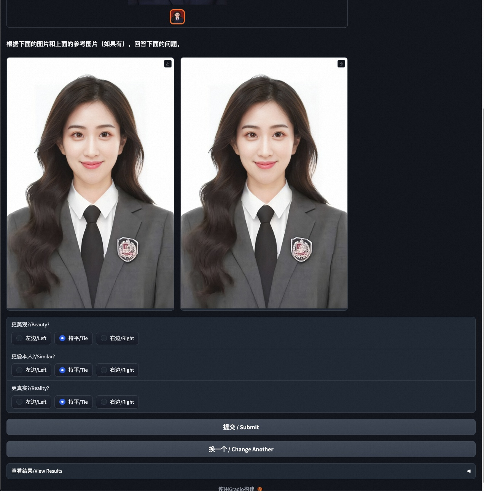

# Test & Profile-23/10/09
## 环境准备
- 请搭建一个待测试的SDWebUI环境
- 保证可以访问到上述SDWebUI，准备python环境，满足依赖 base64/json/numpy/cv2

## 训练/推理测试代码
- **post_train.py** 支持公网URL图片/本地图片读取
- **post_infer.py** 支持公网URL图片/本地图片读取
代码提供了默认URL，可修改，本地图片通过命令行参数输入。


## 测试平均耗时 32G-V100
### 训练
**初始模型下载完成后**，avg_time ~= 7mins， **max_train_steps**=100，参考下图


### 推理
**初始模型下载完成后** avg_infer_time(10次) ~= 20s


### 双盲测试
基于上述的推理代码，我们可以实现预定模板和预定人物的Lora的批量测试图片生成，形成某个版本的记录。并基于此对两个版本的代码的生成结果进行双盲测试，下面，我们简单的使用一个例子进行双盲测试。打开后的UI 如下图



#### 步骤
- 按照环境准备，在环境准备相关的user_id模型
- 准备预设模板和上面user_id对应的真人图片
    - templates
        - 1.jpg
        - 2.jpg
    - ref_image
        - id1.jpg
        - id2.jpg
- 运行批量推理代码
```python
python3 post_infer.py --template_dir templates --output_path test_data/version1
```
- 运行数据整理代码
```python
python3 ./double_blind/format_data2json.py  --ref_images ref_image  --version1_dir test_data/version1 --version2_dir test_data/version2 --output_json test_v1_v2.json
```
- 运行./double_blind/app.py 获取如下双盲测试页面。
```python
python3 ./double_blind/app.py --data-path test_v1_v2.json  --result-path ./result.jsonl
```
运行上述代码后，会得到一个如下页面。如果在域名指定的机器，则可分享相关测试域名(待补充)，然后获得 version1 和version2的 winning rate，作为PR记录。
